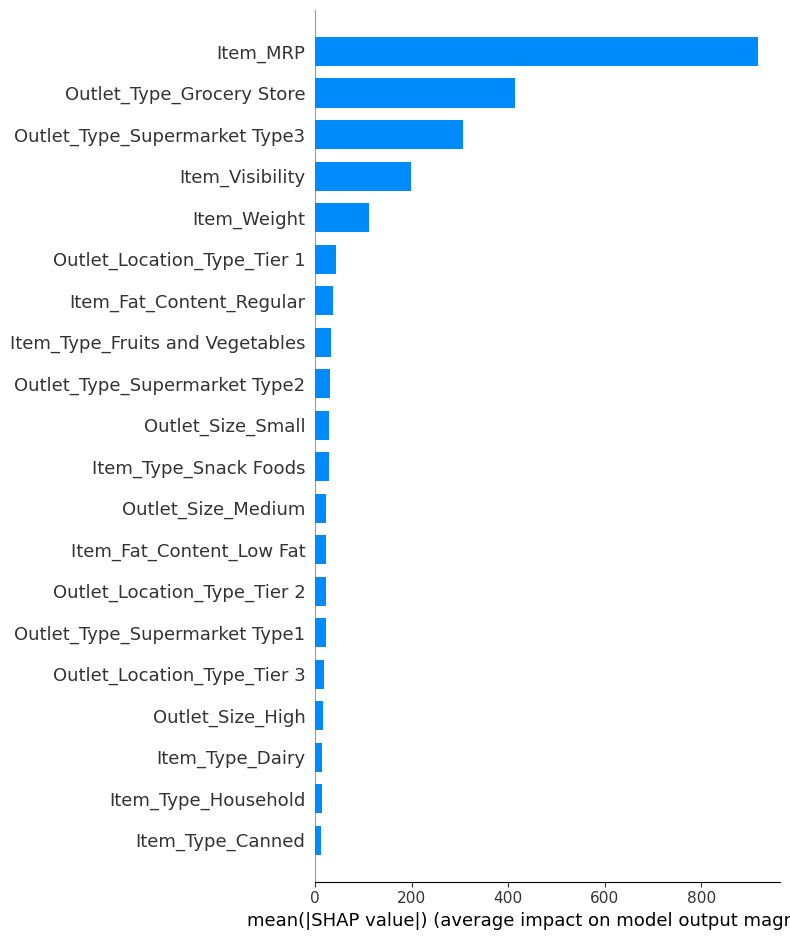

# Sales Model - Revisited

## Coefficients Graph

Top 3 Coefficients:

- Outlet_Size_High: That for every time the product is in High Outlet Size, the value shown will increase the Item Outlet Sale.

- Outlet_Size_Small: That for every time the product is in Small Outlet Size, the value shown will increase the Item Outlet Sale.

- Outlet_Size_Med: That for every time the product is in Med Outlet Size, the value shown will increase the Item Outlet Sale.

## Features Graph

Top 5 Features:

- Item MRP
- Outlet Type Grocery Store
- Item Visibility
- Outlet Type Supermarket Type3
- Item Weight

## SHAP Graph - Bar

## SHAP Graph - Dot
