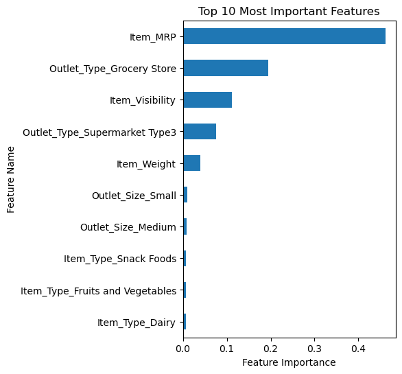
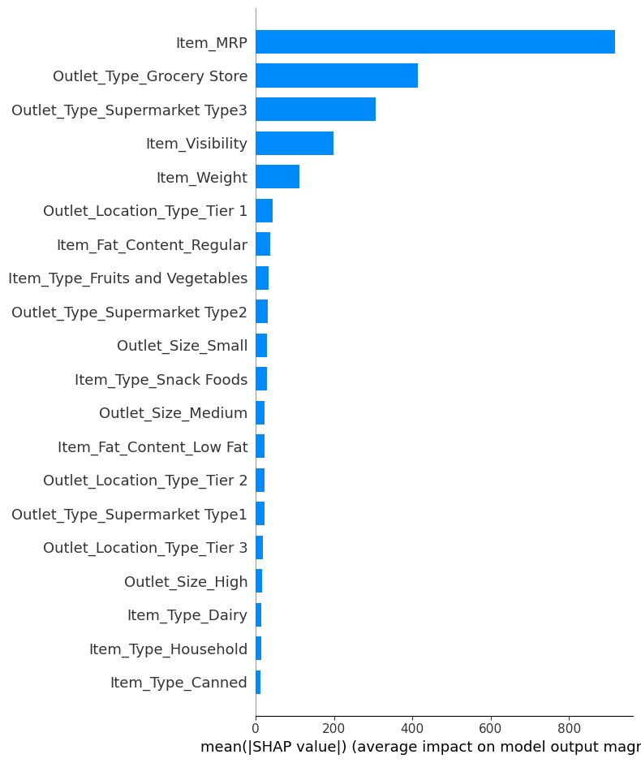
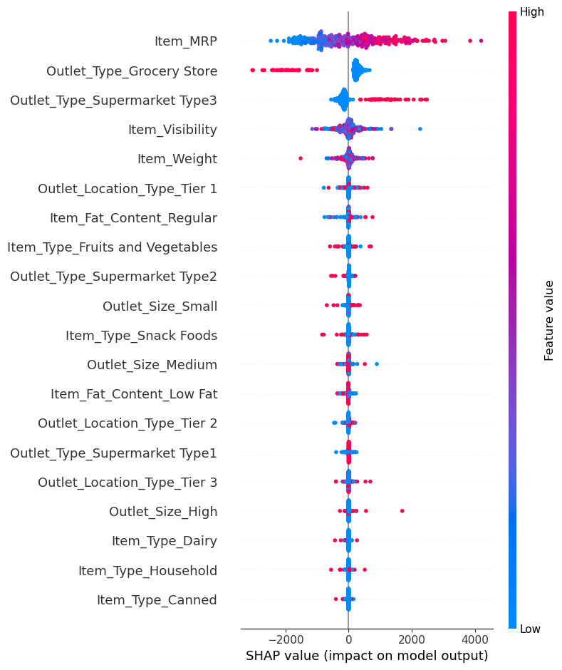
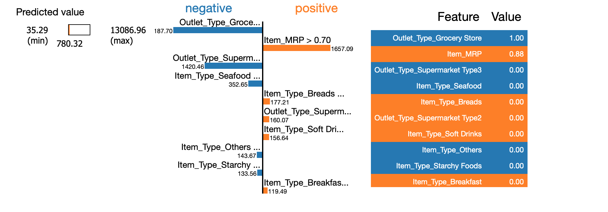
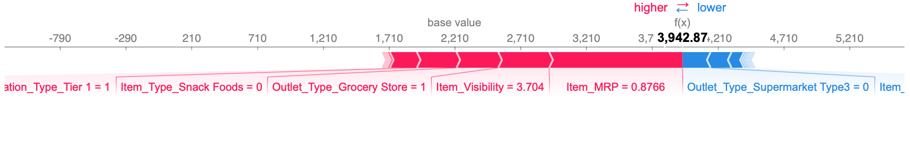
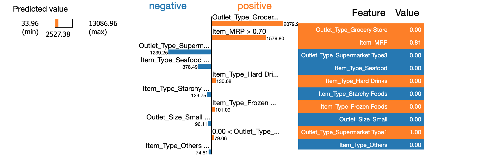
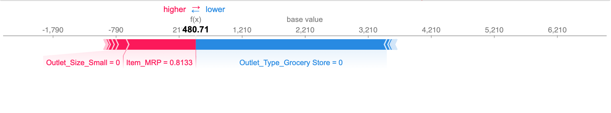

# Sales Model - Revisited

## Coefficients Graph

Top 3 Coefficients:

- Outlet_Size_High: That for every time the product is in High Outlet Size, the value shown will increase the Item Outlet Sale.

- Outlet_Size_Small: That for every time the product is in Small Outlet Size, the value shown will increase the Item Outlet Sale.

- Outlet_Size_Med: That for every time the product is in Med Outlet Size, the value shown will increase the Item Outlet Sale.

## Features Graph

Top 5 Features:

- Item MRP
- Outlet Type Grocery Store
- Item Visibility
- Outlet Type Supermarket Type3
- Item Weight

## SHAP Graph - Bar

- Comparsion vs Features Graph

    - The top 4 are all the same with just Item Visibility and Supermarket Type 3 switching places.
    
    - After that, it varies quite a bit with each one bringing different features for the last 6 spots

## SHAP Graph - Dot

- Top 3 Features

    - Item MRP: This shows that a higher MRP will increase our target.
    
    - Outlet Type Grocery Store: This shows that being classified as a Grocery Store decrease our target.
    
    - Outlet Type Supermarket Type3: This shows that being classified as a Supermarket Type3 increase our target.

## Local Explanations

### The first example I chose was with being classified at a Grocery Story with a MRP above the 75%.
    

    
    - The Grocery Outlet Type and Supermarket Type3 had a negative impact on the total price.
    
    - The Item MRP has a positive impact on the total price. 

    - The Item MRP and Item Visibility are two of the bigger positive impacts on the total price and pushing it higher.

    - The Supermarket Type3 had a negative impact on the total price and pushing it lower. 
    
    
### The second example I chose was with not being classified at a Grocery Story with a MRP above the 75%.

    - The Grocery Outlet Type and Item MRP have a positive impact on the total price. 

    - The Supermarket Type3 has a negative impact on the total price. 

    - The Item MRP and Outlet Size Small are two of the bigger positive impacts on the total price and pushing it higher.

    - The Grocery Store had a negative impact on the total price and pushing it lower. 
